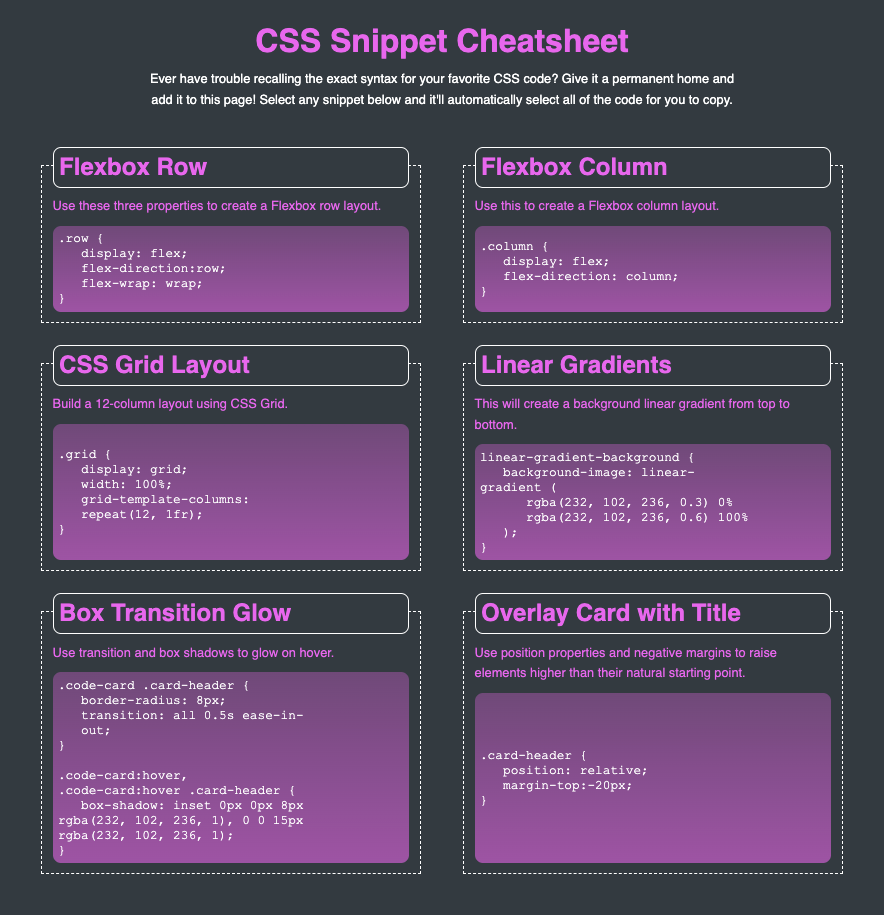

# Week Two Mini-Project

## Description

This webpage holds a collection of CSS snippets, and was intended to test my ability to build a Flexbox layout, and use other advanced CSS techniques. 

## Links

[**Week Two Mini-Project**](https://mbartnett.github.io/CSS-Snippet-Cheatsheet/) 
[**Week Two Mini-Project Repo**](https://github.com/mbartnett/CSS-Snippet-Cheatsheet)

## Screengrabs

## License

Please refer to the LICENSE in the repo.
